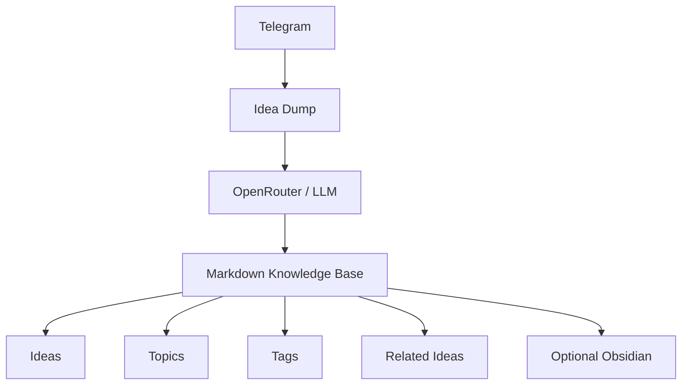
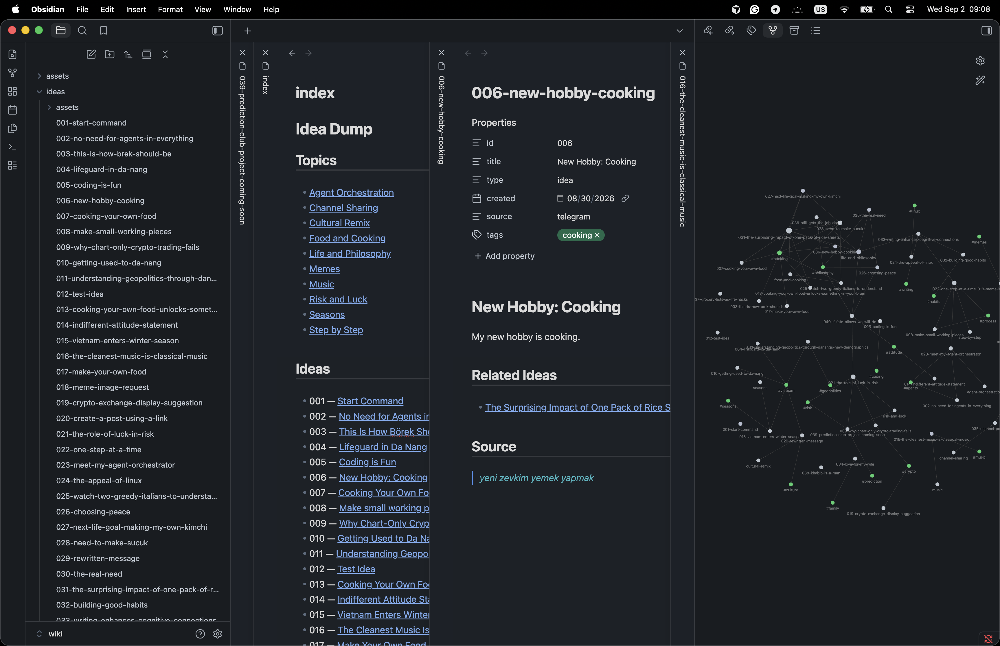

# Idea Dump

Turn rough Telegram messages into a portable Markdown wiki.

```text
Telegram → LLM → Markdown Wiki → Tags / Topics / Related Ideas
```

- Capture rough thoughts from Telegram
- Automatically clean and organize them
- Keep everything as portable Markdown

Obsidian is optional.



Text, text+image, and text+video messages are supported.

## Your ideas become a living wiki



## Why Idea Dump?

For people who want instant capture from Telegram, LLM-assisted cleanup and linking, and a knowledge base they own as ordinary Markdown files.

A local process is enough. A VPS and Obsidian are not required.

## Quick start

### Requirements

- Python 3.10+
- A [Telegram](https://telegram.org/) account
- An [OpenRouter](https://openrouter.ai/) account and API key

### Clone

```bash
git clone https://github.com/0xAnre/idea-dump.git
cd idea-dump
```

### Python environment

```bash
python3 -m venv venv
source venv/bin/activate
pip install -r requirements.txt
```

### Telegram bot

1. Open [@BotFather](https://t.me/BotFather) in Telegram.
2. Send `/newbot` and follow the prompts.
3. Copy the bot token. That is `TELEGRAM_BOT_TOKEN`.

See Telegram’s [BotFather](https://core.telegram.org/bots/features#botfather) notes if needed.

### OpenRouter

1. Create an API key at [OpenRouter](https://openrouter.ai/keys).
2. Pick a chat model from the [model list](https://openrouter.ai/models).
3. Set `OPENROUTER_API_KEY` to the key and `OPENROUTER_MODEL` to the model slug.

Any compatible OpenRouter chat model can work. One known working example:

```text
deepseek/deepseek-v4-flash-0731
```

### Environment

```bash
cp .env.example .env
```

Edit `.env` (never commit this file):

```text
TELEGRAM_BOT_TOKEN=
OPENROUTER_API_KEY=
OPENROUTER_MODEL=
```

### Run

```bash
python main.py
```

Idea Dump is now waiting for Telegram messages. Stop it with **Ctrl+C**.

### Verify it works

1. Message your bot a normal idea, for example: `try cooking lunch at home this week`.
2. Wait a few seconds.
3. Look in `knowledge-base/ideas/`. A new numbered Markdown file should appear (for example `001-….md`).
4. `index.md` and `log.md` may update. The Maintainer may also add tags, Topics, or Related Ideas.

If no file appears, check the terminal for missing env vars or OpenRouter errors, then send another message.

## Run 24/7 on a VPS

Local `python main.py` is enough for normal use and testing. Run on a VPS only if the Telegram bot should stay available when your laptop is off.

Use systemd to keep the process running. Adjust paths to match your server. Example:

```ini
[Unit]
Description=Idea Dump
After=network.target

[Service]
Type=simple
Restart=always
WorkingDirectory=/opt/idea-dump
EnvironmentFile=/opt/idea-dump/.env
ExecStart=/opt/idea-dump/venv/bin/python /opt/idea-dump/main.py

[Install]
WantedBy=multi-user.target
```

The repo file `idea-dump.service` is a template with placeholder paths. It is not plug-and-play. Point `WorkingDirectory`, `EnvironmentFile`, and `ExecStart` at your clone and venv.

## Knowledge base

```text
knowledge-base/
├── schema.md
├── index.md
├── log.md
├── ideas/
├── topics/
└── assets/
```

| Path | Role |
|---|---|
| `schema.md` | Wiki rules for the LLM |
| `index.md` | Entry list of Ideas and Topics |
| `log.md` | Chronological capture log |
| `ideas/` | One Markdown file per Idea |
| `topics/` | Optional wiki pages that group Ideas |
| `assets/` | Images and video referenced by Ideas |

## Obsidian (optional)

`knowledge-base/` is ordinary Markdown. Open that folder as an Obsidian vault if you want a visual browser. Obsidian is not required to capture or store Ideas.

## Tests

```bash
python -m unittest discover -s tests
```

## Scripts

`scripts/` holds one-off migrators for older Idea Dump wikis. A fresh install does not need them.

## License

MIT
